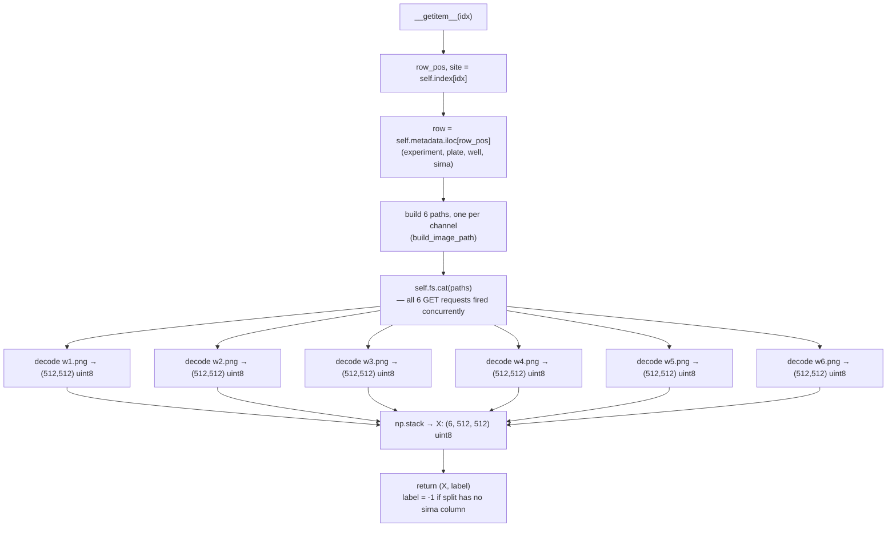
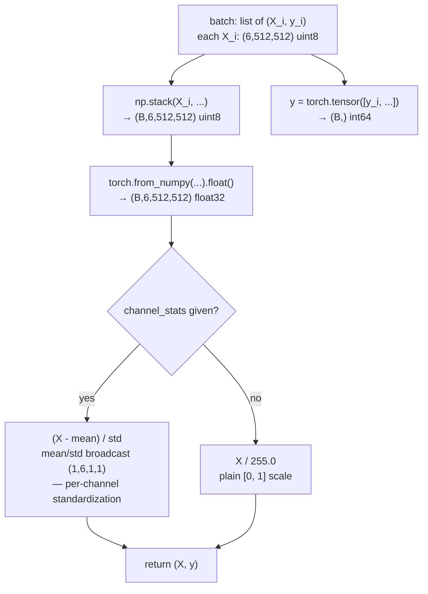

# `src/data/rxrx1.py`

RxRx1 — [Recursion Cellular Image Classification](https://www.kaggle.com/competitions/recursion-cellular-image-classification) ([rxrx.ai/rxrx1](https://rxrx.ai/rxrx1)).


The following code streams images directly from the public `rxrx1-us-central1` GCS bucket via `gcsfs` (`token="anon"`) — nothing downloaded to local disk. There are 51 experiments across 4 cell lines (HUVEC, RPE, HEPG2, U2OS), 4 plates per experiment, 2 imaging sites per well, 6 fluorescence channels per site (Hoechst/ConA/Phalloidin/Syto14/MitoTracker/WGA), each a 512×512 grayscale PNG.

---

## Pipeline

```
fetch_metadata (train.csv/test.csv)  →  RxRx1Dataset (streams images live)  →  RxRx1CollateFn (batch + standardize)  →  model
                                              ↑
                              compute_channel_stats (pixel_stats.csv, no image fetch — computed once, cached, reused across the run)
```

Each metadata row (one well) expands into `len(sites)` dataset items — a well is imaged at 2 non-overlapping sites, both normally used as independent training examples.

---

## Bucket layout

```
gs://rxrx1-us-central1/
  metadata/
    train.csv         # id_code, experiment, plate, well, sirna
    test.csv           # id_code, experiment, plate, well   (no sirna — Kaggle-withheld label)
    pixel_stats.csv     # id_code, experiment, plate, well, site, channel, mean, std, median, min, max
  images/
    train/{experiment}/Plate{plate}/{well}_s{site}_w{channel}.png
    test/{experiment}/Plate{plate}/{well}_s{site}_w{channel}.png
```

`experiment` encodes cell line + batch, e.g. `HEPG2-01` = HEPG2 cells, batch 1 (`cell_type` in `fetch_metadata`'s output is this split on `-`). `well` is a 384-well-plate coordinate (e.g. `B03`). `site` is `1` or `2`. `channel` is `1`–`6` (see `CHANNEL_NAMES`).

---

## Constants

```python
RXRX1_BUCKET = "rxrx1-us-central1"
N_SITES = 2
N_CHANNELS = 6
IMG_SIZE = 512
CHANNEL_NAMES = {1: "Hoechst (nucleus)", 2: "ConA (endoplasmic reticulum)",
                 3: "Phalloidin (actin cytoskeleton)", 4: "Syto14 (nucleolus)",
                 5: "MitoTracker (mitochondria)", 6: "WGA (golgi apparatus)"}
```

---

## Metadata

### `fetch_metadata`

```python
fetch_metadata(
    split: Literal["train", "test"] = "train",
    cell_types: list[str] | None = None,
    bucket: str = RXRX1_BUCKET,
) -> pd.DataFrame
```

Returns the `id_code`/`experiment`/`plate`/`well`(`/sirna`) table for a split, read straight off GCS (`pd.read_csv("gs://...", storage_options={"token": "anon"})`). Adds a `cell_type` column parsed from `experiment` (`"HEPG2-01"` → `"HEPG2"`); pass `cell_types` to filter up front rather than filtering the returned table yourself.

### `compute_channel_stats`

```python
compute_channel_stats(
    cell_types: list[str] | None = None,
    bucket: str = RXRX1_BUCKET,
) -> dict[int, tuple[float, float]]
```

Returns `{channel: (mean, std)}` for standardization, from the bucket's precomputed `pixel_stats.csv` — no image data is fetched.

`pixel_stats.csv` has one row per (image, channel), each an equally-sized 512×512 group. Per-channel mean is the mean of per-image means; per-channel variance uses the law of total variance — `mean(var_i) + var(mean_i)` — instead of averaging `std` directly, which would ignore between-image variance and understate the true spread.

### `build_image_path`

```python
build_image_path(experiment, plate, well, site, channel, split="train", bucket=RXRX1_BUCKET) -> str
```

Returns the bucket-relative path, e.g. `"rxrx1-us-central1/images/train/HEPG2-01/Plate1/B03_s1_w1.png"`. No `"gs://"` prefix — that's what `gcsfs.GCSFileSystem.open`/`.cat` expect; `pd.read_csv` above takes the `"gs://"` form instead, since that goes through fsspec's URL-based dispatch rather than a filesystem object.

---

## PyTorch dataset

### `RxRx1Dataset`

```python
RxRx1Dataset(
    metadata: pd.DataFrame,
    split: str = "train",
    sites: tuple[int, ...] = (1, 2),
    channels: tuple[int, ...] = (1, 2, 3, 4, 5, 6),
    bucket: str = RXRX1_BUCKET,
)
```

Map-style `torch.utils.data.Dataset` — GCS serves random single-object reads fine at this dataset size, so plain index-based access works, and it's what `DistributedSampler` expects for multi-GPU training.

#### `__getitem__`



Fetching the 6 channels sequentially (`for channel in channels: fs.open(path).read()`) measured ~2.7s per item. `fs.cat(paths)` fetches the same list concurrently over gcsfs's async backend: ~0.35s, ~7.7x. `google-cloud-storage` sequential measured only ~1.7x faster than `gcsfs` sequential — concurrency is the larger effect by far.

#### `self.fs` and `worker_init_fn`

`__init__` builds `self.fs = gcsfs.GCSFileSystem(token="anon")` once, used directly for `num_workers=0`. With `num_workers > 0`, pass `worker_init_fn=worker_init_fn` (this module's) to `DataLoader` — each forked worker inherits the parent's `self.fs` via a raw memory copy, and `worker_init_fn` rebuilds it fresh in the worker process instead.

Verified with `os.fork()`: fsspec's usual same-args instance cache does *not* hand the child back the parent's instance here. `fsspec.asyn` registers `os.register_at_fork(after_in_child=reset_after_fork)`, and each instance checks `self._pid` against `os.getpid()`, so the cache rebuilds itself post-fork. Re-calling `gcsfs.GCSFileSystem(token="anon")` in `worker_init_fn` triggers that rebuild.

### `RxRx1CollateFn`

```python
RxRx1CollateFn(channel_stats: dict[int, tuple[float, float]] | None = None)
```



Per-channel standardization matters because RxRx1 has strong batch effects between experiments — different confocal runs, reagent lots. `channel_stats` keys must match the dataset's `channels` in the same order (default: both `1..6`) — a `channels` subset needs `channel_stats` computed/filtered the same way.

---

## Design notes

| Decision | Reason |
|----------|--------|
| Map-style `Dataset`, not `IterableDataset` | RxRx1's metadata fits in memory and GCS serves random single-object reads fine at this scale (~1.2M images total). Simpler, and what `DistributedSampler` expects for multi-GPU training later. |
| `fs.cat(paths)` instead of per-channel `fs.open().read()` in a loop | Sequential per-channel fetches serialize `n_channels` network round trips (~2.7s for 6). `fs.cat()` fetches the whole list concurrently over gcsfs's async backend (~0.35s, ~7.7x). |
| `channel_stats` uses law of total variance, not `mean(std)` | `pixel_stats.csv` gives per-image mean/std; averaging `std` across images directly ignores how much the per-image *means* vary, understating the true channel-wide spread. |
| `self.fs` built eagerly in `__init__`, rebuilt via `worker_init_fn` for `num_workers>0` | Keeps `num_workers=0` simple while staying correct under DataLoader's fork-based worker processes — see `worker_init_fn`'s docstring for the fork-safety mechanism this relies on. |
| `GRPC_VERBOSITY=ERROR` set at module import time | `grpc` is an unused transitive dependency (GCS reads go over plain HTTP via aiohttp, not grpc) that still registers a fork handler, logging "Other threads are currently calling into gRPC" / "FD from fork parent" at INFO level on every worker fork. Raises grpc's logging threshold only — `GRPC_ENABLE_FORK_SUPPORT=0` would also silence it but disables grpc's actual fork-safety behavior instead, so it's not used here. |
| No PCA / dimensionality reduction step | A CNN/ViT's early layers are more expressive than a fixed linear projection, and per-channel standardization already covers what hand-designed preprocessing would. |

---

## `scripts/rxrx1/test_dataloader.py`

Throughput benchmark — loops one epoch of the train split with `tqdm`, reporting images/s, batches/s, s/batch. Run with `--num-workers 0` first to isolate single-process fetch speed, then increase to see multiprocessing gains on top of the `fs.cat()` concurrency fix above.

```bash
# Quick smoke test — a few hundred images, no channel-stats fetch
python scripts/rxrx1/test_dataloader.py --limit 200 --skip-normalize

# Full train split for one cell line, real throughput numbers
python scripts/rxrx1/test_dataloader.py --cell-types HEPG2 --num-workers 4
```
